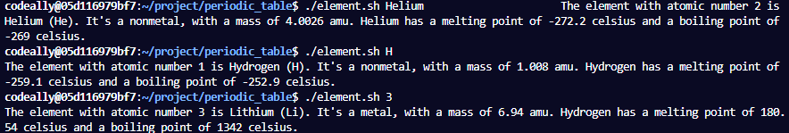
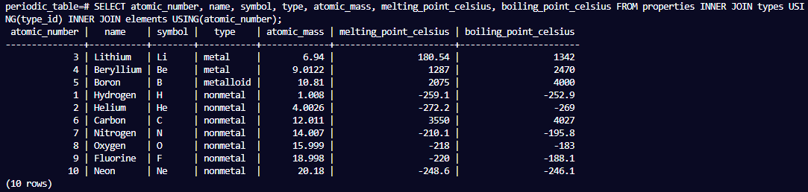
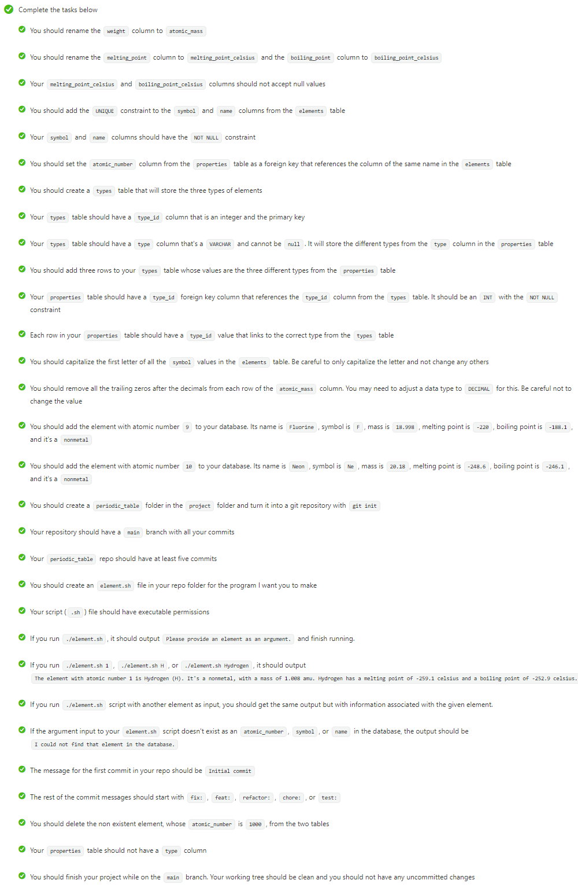

# Periodic Table Database

- This Celestial Bodies database was built using PostgreSQL and a shell script to display information.

Technologies used: PostgreSQL, Shell Script

# Live Version Output

# Requirements

